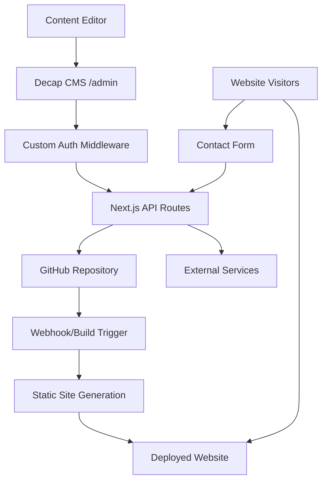

# Design Document

## Overview

The Next.js Marketing CMS is a self-hosted website solution that combines Next.js static site generation with Decap CMS for content management. The architecture prioritizes SEO performance, security, and ease of content editing while maintaining flexibility for future integrations.

The system uses a Git-based workflow where content changes trigger automatic rebuilds, ensuring the site remains fast and SEO-optimized while providing a user-friendly editing experience.

## Architecture

### High-Level Architecture



### Technology Stack

- **Frontend Framework**: Next.js 14+ with App Router
- **Content Management**: Decap CMS (formerly Netlify CMS)
- **Authentication**: Custom middleware with environment-based credentials
- **Styling**: Tailwind CSS for responsive design
- **Type Safety**: TypeScript throughout
- **Content Storage**: Git-based (GitHub repository)
- **Deployment**: AWS Amplify or self-hosted with Docker

## Components and Interfaces

### 1. Authentication System

**Custom Auth Middleware** (`middleware.ts`)

- Protects `/admin` routes using Next.js middleware
- Validates credentials against environment variables
- Supports both basic auth headers and session-based authentication
- Redirects unauthorized users to login page

**Environment Variables**:

```typescript
interface AuthConfig {
  ADMIN_USERNAME: string;
  ADMIN_PASSWORD: string;
  GITHUB_TOKEN: string;
  GITHUB_REPO: string;
  GITHUB_BRANCH: string;
}
```

### 2. Decap CMS Integration

**CMS Configuration** (`public/admin/config.yml`)

- Backend configuration for Git Gateway
- Content collections definition
- Media folder configuration
- Editorial workflow settings

**GitHub Token Provider** (`/api/cms-auth`)

- Secure API endpoint that provides GitHub token to Decap CMS
- Validates admin session before token provision
- Never exposes token to client-side code

### 3. Content Management

**Content Types**:

- Pages (Home, About, Services, Contact)
- Projects (with image galleries)
- Blog Posts
- Site Settings (global configuration)

**Content Structure**:

```typescript
interface Page {
  title: string;
  slug: string;
  content: string;
  seo: SEOMetadata;
  publishedAt: Date;
}

interface Project {
  title: string;
  description: string;
  images: string[];
  category: string;
  completedAt: Date;
  featured: boolean;
}
```

### 4. Static Site Generation

**Build Process**:

- Uses Next.js `generateStaticParams` for dynamic routes
- Implements ISR (Incremental Static Regeneration) for content updates
- Generates sitemap and robots.txt automatically
- Optimizes images using Next.js Image component

**SEO Optimization**:

- Dynamic meta tags generation
- Structured data (JSON-LD) for construction business
- Open Graph and Twitter Card support
- Semantic HTML structure

### 5. Contact Form System

**Form Component** (`components/ContactForm.tsx`)

- Client-side validation using React Hook Form
- Accessible form design with proper ARIA labels
- Loading states and error handling
- CAPTCHA integration option

**API Handler** (`/api/contact`)

- Server-side validation and sanitization
- Rate limiting to prevent spam
- Modular integration system for external services
- Email notification system

## Data Models

### Content Models

```typescript
// Core content types
interface SEOMetadata {
  title: string;
  description: string;
  keywords: string[];
  ogImage?: string;
}

interface Page {
  id: string;
  title: string;
  slug: string;
  content: string;
  seo: SEOMetadata;
  publishedAt: Date;
  updatedAt: Date;
}

interface Project {
  id: string;
  title: string;
  description: string;
  images: ProjectImage[];
  category: ProjectCategory;
  completedAt: Date;
  featured: boolean;
  seo: SEOMetadata;
}

interface ProjectImage {
  src: string;
  alt: string;
  caption?: string;
}

enum ProjectCategory {
  KITCHEN = 'kitchen',
  BATHROOM = 'bathroom',
  ADDITION = 'addition',
  RENOVATION = 'renovation',
}
```

### Configuration Models

```typescript
interface SiteConfig {
  siteName: string;
  siteUrl: string;
  description: string;
  contact: ContactInfo;
  social: SocialLinks;
  seo: GlobalSEO;
}

interface ContactInfo {
  phone: string;
  email: string;
  address: Address;
  businessHours: BusinessHours[];
}
```

## Error Handling

### Authentication Errors

- Invalid credentials: Redirect to login with error message
- Expired sessions: Force re-authentication
- Missing environment variables: Graceful degradation with admin warnings

### CMS Integration Errors

- GitHub API failures: Retry logic with exponential backoff
- Token expiration: Automatic refresh mechanism
- Network issues: Offline mode with local storage fallback

### Form Submission Errors

- Validation errors: Client-side feedback with field-specific messages
- API failures: Retry mechanism with user notification
- External service errors: Fallback to email notification

### Build and Deployment Errors

- Content parsing errors: Skip invalid content with warnings
- Image optimization failures: Fallback to original images
- Static generation errors: Partial builds with error reporting

## Testing Strategy

### Unit Testing

- Component testing with React Testing Library
- API route testing with Jest and MSW
- Utility function testing
- Authentication middleware testing

### Integration Testing

- CMS workflow testing (content creation to deployment)
- Form submission end-to-end testing
- GitHub integration testing
- Build process testing

### Security Testing

- Authentication bypass attempts
- Environment variable exposure testing
- XSS and injection vulnerability testing
- Rate limiting effectiveness testing

### Performance Testing

- Core Web Vitals monitoring
- Static generation performance
- Image optimization effectiveness
- API response time testing

### Content Testing

- Content validation and sanitization
- SEO metadata generation
- Sitemap generation accuracy
- Structured data validation

## Security Considerations

### Authentication Security

- Environment-based credentials (never in code)
- Secure session management
- HTTPS enforcement
- CSRF protection on admin routes

### Content Security

- Input sanitization for all user content
- XSS prevention in rendered content
- File upload restrictions and validation
- Content Security Policy headers

### API Security

- Rate limiting on all public endpoints
- Input validation and sanitization
- Secure GitHub token handling
- CORS configuration

### Infrastructure Security

- Environment variable encryption
- Secure deployment practices
- Regular dependency updates
- Security header implementation
